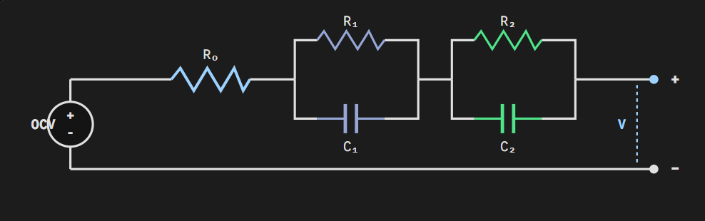
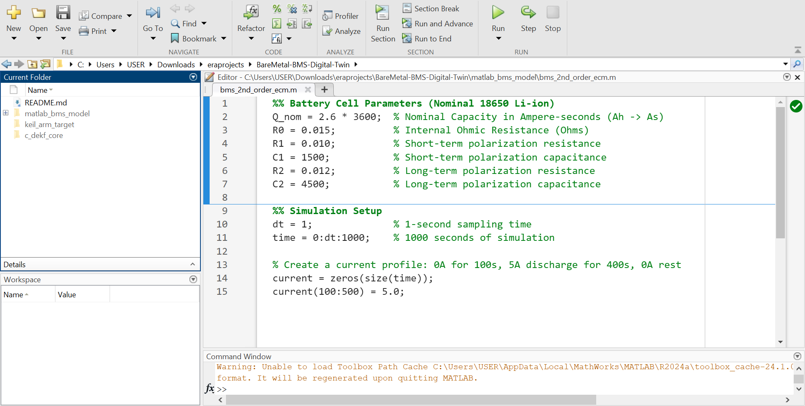
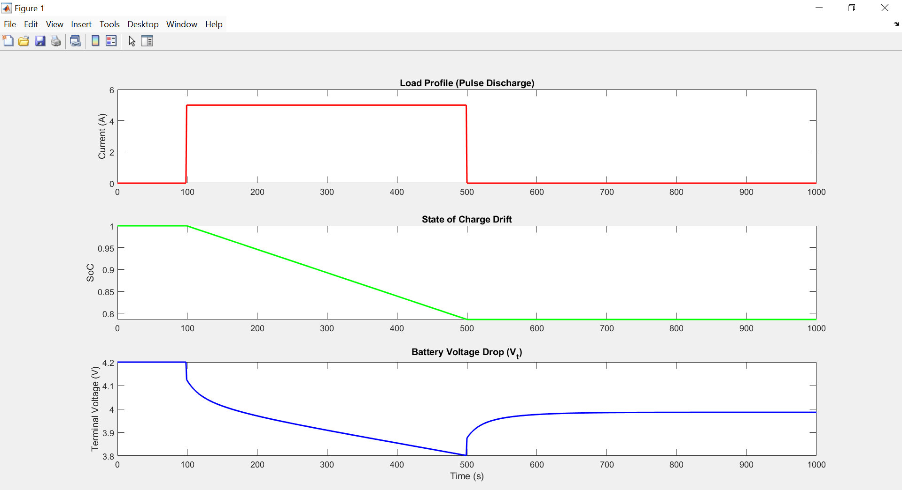
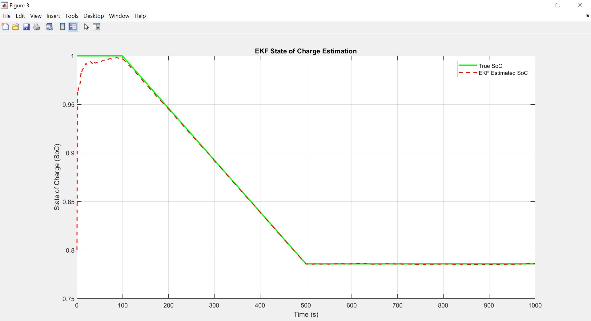

# Bare-Metal BMS Digital Twin: Dual Extended Kalman Filter on ARM Cortex-M4

**Author:** Oloore Issa Abayomi  
**Architecture:** ARM Cortex-M4 (STM32F401RE) | Keil uVision 5 | ARM Compiler 6 (armclang)  
**Domain:** Control Systems Engineering, Edge AI, Embedded C, Battery Management Systems (BMS)

## 📌 Project Overview
This project implements a continuous-time **Dual Extended Kalman Filter (DEKF)** for real-time Battery State-of-Charge (SoC) estimation, executing on a purely bare-metal ARM Cortex-M4 target. 

Designed as a masterclass in deterministic execution and low-level computer architecture, this implementation bridges the gap between high-level MATLAB simulation and optimized silicon-level execution, completely bypassing standard vendor Hardware Abstraction Layers (HAL) and bulky code generators (like STM32CubeMX).

---

## 🛠 Phase 1: Mathematical Modeling & Simulation (MATLAB)

Before writing any C code, the physical battery dynamics were modeled mathematically to serve as the foundation for the Digital Twin.

### The 2nd-Order Thevenin Equivalent Circuit Model
The system is modeled using a 2nd-order ECM featuring an Open Circuit Voltage (OCV) source, instantaneous ohmic resistance ($R_0$), short-term polarization ($R_1, C_1$), and long-term polarization ($R_2, C_2$).

### Cell Parameterization
The model simulates a nominal 18650 Li-ion cell. Parameters were defined in MATLAB, including a nominal capacity ($Q_{nom}$) of 2.6 Ah (converted to Ampere-seconds), and distinct RC branches to capture varying transient responses.

### Forward Simulation & Load Profiling
To validate the model, a 1000-second simulation was executed featuring a 5A pulse discharge from $t=100s$ to $t=500s$, accurately capturing the subsequent SoC drift and non-linear terminal voltage ($V_t$) recovery dynamics.

---

## 🧠 Phase 2: Algorithm Design & Digital Twin Data Export

With the physical model established, the mathematical state estimator (Dual EKF) was designed and validated against the synthetic data.

### EKF SoC Convergence Validation
The Kalman Filter was initialized with a deliberately inaccurate SoC guess to prove its robustness. As plotted in MATLAB, the EKF Estimated SoC aggressively corrects itself, tracking the True SoC precisely despite the initial offset.

### Bridging the Gap: MATLAB to C
To test the C-implementation against the exact same physics, the simulated current and voltage vectors were exported directly from the MATLAB workspace into a C header file (`synthetic_bms_data.h`) using `const float` arrays.

---

## 🚀 Phase 3: Bare-Metal Cortex-M4 Implementation

The continuous-time algorithm was translated into deterministic, fixed-step Embedded C and flashed to the ARM Cortex-M4 architecture.

### Advanced Memory Mapping & Compilation
The compiler was directed via a custom Scatter File (`.sct`) to explicitly define the 512KB Flash and 96KB SRAM boundaries. This isolated the massive synthetic sensor arrays into Read-Only Flash while carving out a protected 4KB stack boundary, preventing IEEE-754 floating-point data from overwriting processor registers. The project compiles cleanly without reliance on MicroLIB or an RTOS.

### Hardware-Level FPU Unlocking & Digital Twin Execution
A custom bare-metal bootloader (`startup.c`) was engineered to directly interface with the Cortex-M4 System Control Block (`SCB_CPACR`), manually powering on the hardware Floating-Point Unit (FPU). This allows the continuous-time math to execute natively on silicon.

Executing via the Keil ARM instruction simulator, the Watch Window proves successful matrix math execution. The local structural memory tracks the `SoC` recalculating from the initial 80.0% guess up to the converged **99.11%** state.

---

## 🗂 Project Architecture

The repository is logically separated into mathematical modeling, core C logic, and target-specific compiler environments:

* **`matlab_bms_model/`**: Contains the MATLAB scripts used to simulate the battery physics and generate the synthetic current/voltage datasets[cite: 20].
* **`c_dekf_core/`**: The hardware-agnostic C implementation and bare-metal boot sequence[cite: 20].
  * `dekf_core.c` & `dekf_core.h`: The pure C implementation of the Kalman Filter[cite: 21].
  * `synthetic_bms_data.h`: The synthetic sensor data exported from MATLAB as `static const` arrays[cite: 21].
  * `main.c`: The main execution loop processing the data through the EKF[cite: 21].
  * `startup.c`: The custom Cortex-M4 bootloader mapping the vector table and initializing the FPU[cite: 21].
  * `stm32f401re.sct`: The custom linker scatter file defining Flash/SRAM boundaries[cite: 21].
* **`keil_arm_target/`**: The Keil uVision 5 project directory containing the `BMS_Digital_Twin.uvprojx` configuration, object files, and ARM Compiler 6 layout[cite: 20, 22].
* **`docs/`**: Documentation assets and execution proof images[cite: 20].

---

## ⚙️ How to Build and Run
1. Clone this repository and open `keil_arm_target/BMS_Digital_Twin.uvprojx` in Keil uVision 5[cite: 22].
2. Ensure **ARM Compiler 6** is selected in the Target Options.
3. In Linker options, verify `--datacompressor=off` is active and the custom `../c_dekf_core/stm32f401re.sct` file is linked.
4. Press `F7` to build the target.
5. Press `Ctrl + F5` to launch the debugger. Place a breakpoint on the `EKF_Predict()` loop in `main.c` and step through to watch the `bms_state.SoC` memory address dynamically calculate and converge.